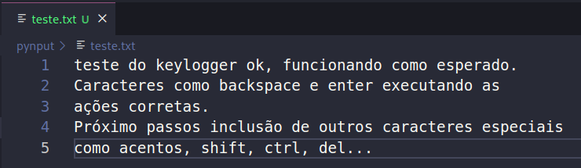

## Keylogger utilizando a biblioteca pynput

    pip install pynput

### Exemplo de uso

Execução do script **pynput_linux_windows.py**:

Texto digitado no arquivo **teste.txt**:

Teclas gravadas no arquivo **log.txt** pelo script:

