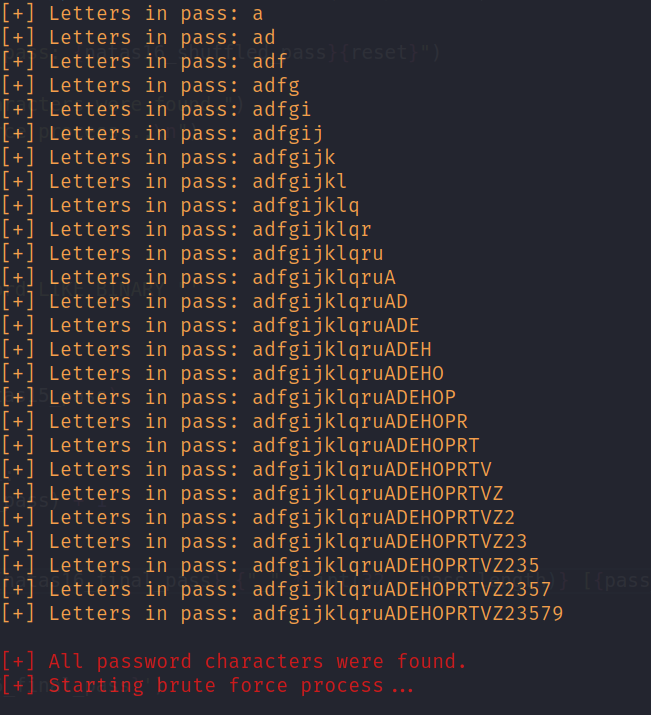
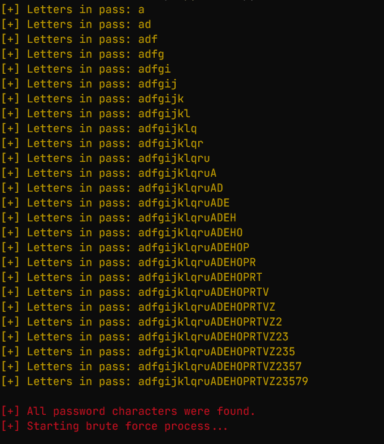
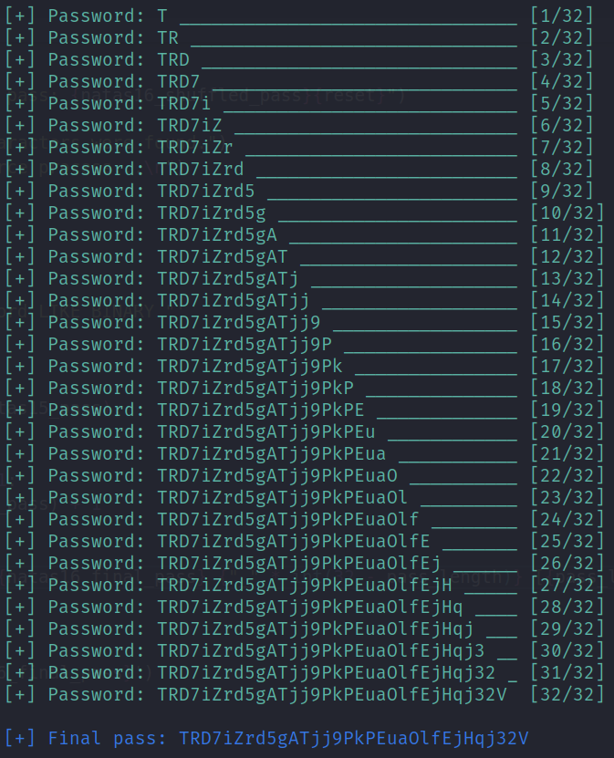
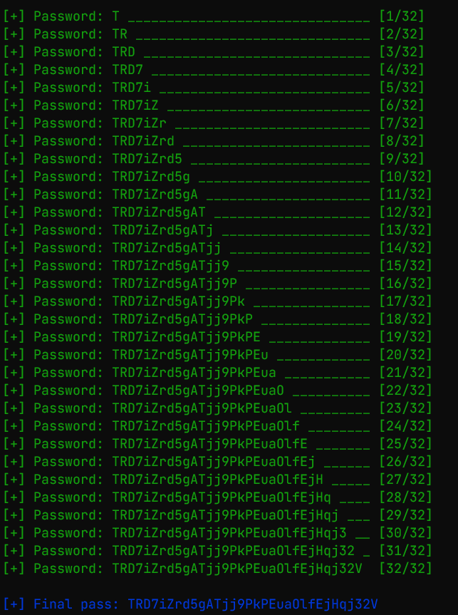

## Natas15

Script criado para a resolução do desafio natas15 da comunidade OverTheWire o qual era necessário a exploração de uma falha **blind sql injection**:

    http://natas15.natas.labs.overthewire.org/

    Password: TTkaI7AWG4iDERztBcEyKV7kRXH1EZRB

### Blind SQL Injection

    Uma falha de Blind SQL Injection ocorre quando um atacante explora uma vulnerabilidade em um aplicativo da web para injetar consultas SQL maliciosas, mas não recebe as respostas diretamente da aplicação. Em vez disso, o atacante precisa inferir informações com base no comportamento da aplicação.

Nesse caso o comportamente usado foi a resposta da aplicação **"This user exists."**.

---

#### Confirmação das letras existentes no password

#### Linux

#### Windows

#### Realização do brute force

#### Linux

#### Windows

#### Password natas16

    TRD7iZrd5gATjj9PkPEuaOlfEjHqj32V

